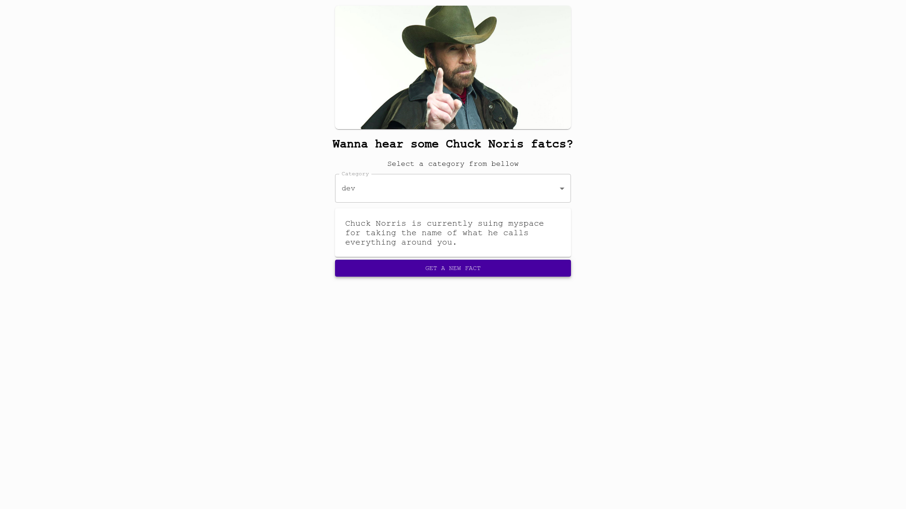

[](https://code.visualstudio.com/)


# Desafio frontend Guia Bolso

Minha implementação do desafio.

https://leonardocpn.github.io/guia-bolso-desafio/

- React com Typescript
- Testes com Enzyme
- Docker
- Travis CI
- Github pages
- Material UI
- Styled Components

## Executando a Aplicação:

```sh
  # Torne o arquivo entrypoint.sh executavel
  $ chmod +x ./.docker/entrypoint.sh

  # Execute o projeto com docker
  $ docker-compose up
```

## Resultado

### Celular

<h1 align="center">
    
</h1>

### Desktop

<h1 align="center">
    
</h1>
